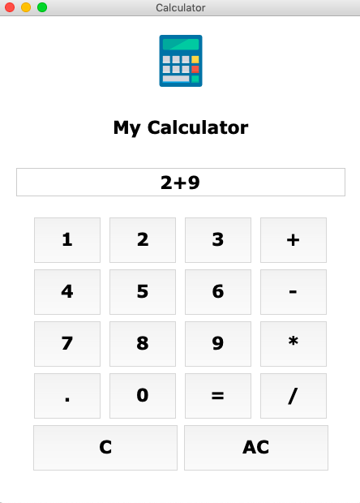

# Simple-Calculator-Using-Python-GUI-Tkinter-Library
This repository contains the code for simple calculator using one of the python libraries "Tkinter" Library. The purpose of creating this repository is to help the people who are just new to tkinter.

The screenshot will help you in understading the flow of code.

## Image 1

## Image 2

